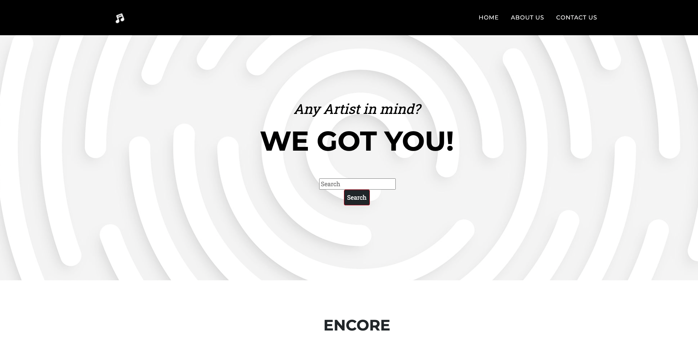
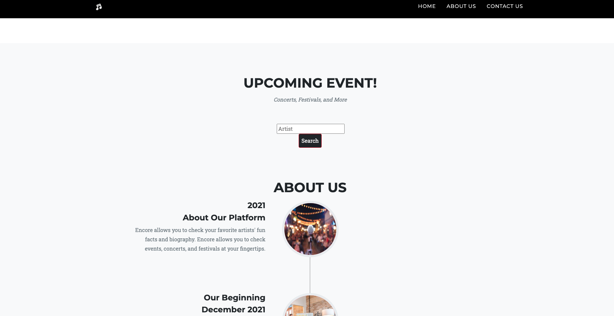

# project-one

## Purpose

The purpose of our application will be to provide the user the ability to:

- learn more about an artists background and interesting facts about them

- find upcoming events related to their favourite artists

Built with:

- HTML
- Bootstrap CSS
- Javascript
- Ticket Master API
- The Audio DB API

## Description:

This application will provide the user to learn interesting facts and biography of their favorite artists. 

This will also provide information of their upcoming events. 

Demo video 

https://user-images.githubusercontent.com/92761848/148670401-6b15076d-4fdc-4c2c-8932-a5fa68f12731.mp4

## Website: 
https://idjh263.github.io/project-one/

## Contributors: 

Made by the  Team members:

- Emilia Velasco
- Conor Bergauer
- Irene Hipolito
- Justin McIntyre

also with the help of tutors in Trilogy and TA's (Ismael & Estiven 👍🏼)
